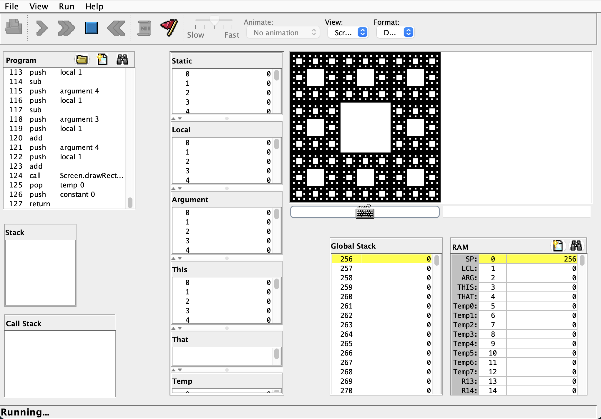

# Project 9: High-Level Language

このコースオリジナルのJavaと似たJackという言語でアプリケーションを作成した。

今回はスクリーンとキーボードを使った例として、フラクタル図形であるシェルピンスキーのカーペットを描画するプログラムを作成した。
何らかのキーが押されるたびに描画の処理を実行し、より細かい図形になっていくが、スクリーンの解像度の制限から6回目には表示が崩れてしまう。

