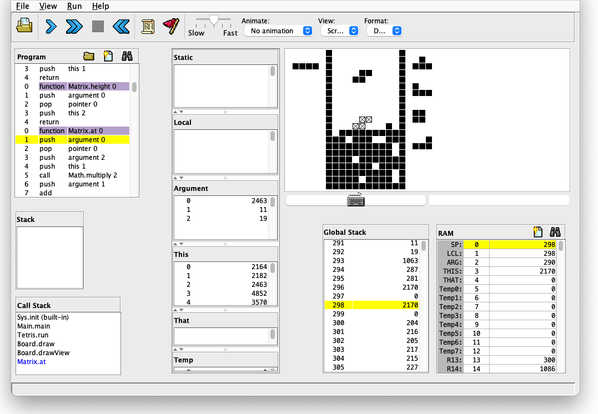

# Project 13

nand2tetrisという名前にもかかわらずテトリスを作らずに終わるのはモヤモヤしたため、Jack言語でテトリスを作成した。

### 操作方法

- 移動: ← or →  
- 回転: A or D  
- 高速落下: ↓  
- ハードドロップ: ↑  
- ホールド: S

せっかく作成するならある程度きちんとしたものを作ろうと考え、まずはテトリスのルールや仕様を学んだ。
その際に参考にしたのは、主に以下の3つのページである。

- https://tetrisch.github.io/main/rule.html
- https://qiita.com/ki_ki33/items/35566f052af7b916607b
- https://nestetrisjp.github.io/das-introduction/

上記のページで学んだことを踏まえて、テトリスを実現する最低限の機能に加えて以下の機能を実装した。

- バッグシステム  
  7つのミノが入ったバッグからランダムに取り出すようにミノを出現させる機能

- Hold機能  
  ミノを1つだけホールドしておける機能

- Nextブロック表示  
  次に出現するミノを事前に表示する機能

- ゴーストブロック表示  
  このまま真下に落下させるとどこに置かれるのか表示する機能

- SRS(Super Rotation System)  
  より直感的に回転できるようにする機能

- DAS(Delayed Auto Shift)  
  キー長押しでミノを高速で移動できる機能

- 設置判定  
  ミノが底についても即座に設置されずに移動・回転できる機能

テトリスを作成するために、一般的な高級言語には存在してJack言語には存在しない機能を実装した。

まず作成したのは、2次元配列である。
`Matrix`というクラスに水平反転や回転、転置などの処理を実装し、ミノやボード（ミノが降ってくるプレイエリア）を表現するのに利用した。

またランダムにミノを出現させるために必要な乱数生成の処理も実装した。
乱数生成には、処理を簡単に記述できるためXorshiftというアルゴリズムを採用した。

本プログラム作成のベースとして利用した`Pong`のプログラムでなぜかシングルトンパターンが採用されていたため、本プログラムでもそのままシングルトンパターンを採用した。
シングルトンパターンが活きる場面はないと思っていたが、`Board`クラスから`Tetris`クラスを参照する場面や`Mino`クラスから`Board`クラスを参照する場面で活躍した。

Jack言語では他のインスタンスのメンバ変数に直接アクセスすることはできないため、必要になるたびにgetterメソッドを定義しなければならないのが少し面倒くさかった。

一通り完成させることはできたが、しっかりテストできていないためまだバグが残っていると思われる。
特にSRSは参考にしたページの表を見ながら処理を記述し、壁や床に接触した状態でも回転できることを確認しただけであるため,バグがある可能性が高いと考えている。
